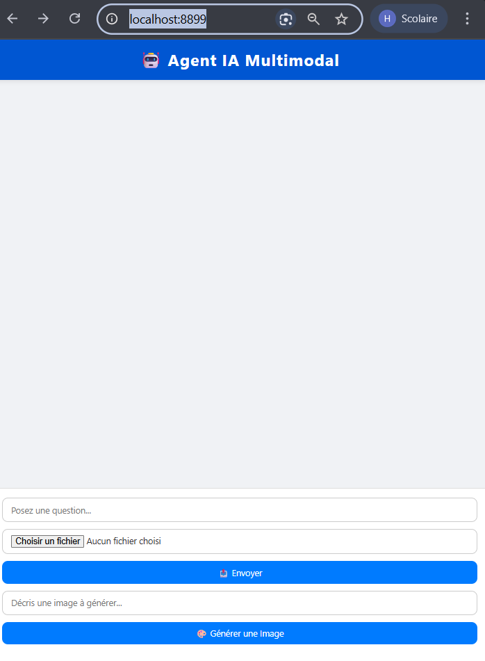
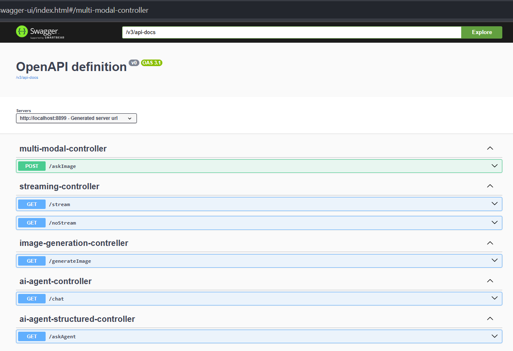
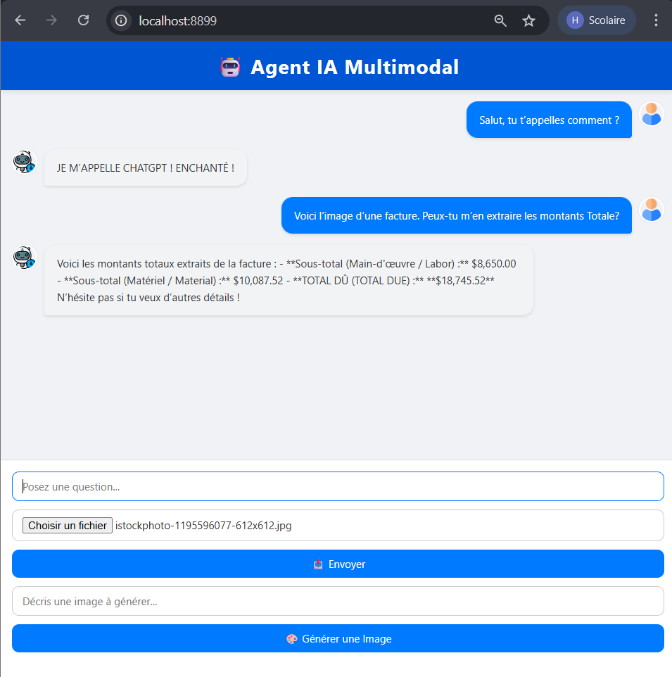
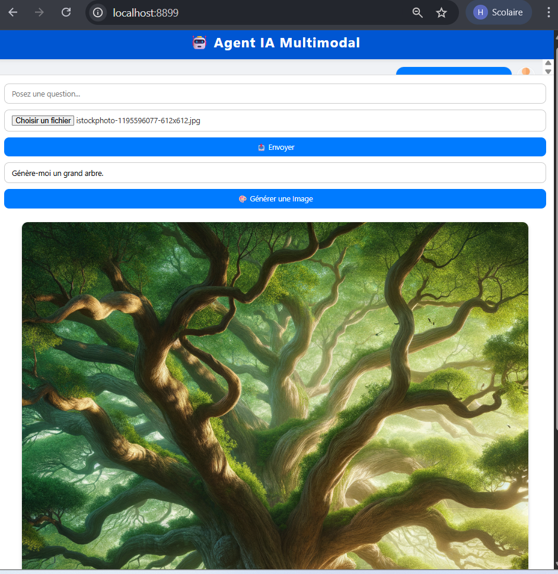

# Agent IA Multimodal (Spring Boot + OpenAI)

Ce projet est une **application web basée sur Spring Boot**, **Spring AI** qui propose un **assistant IA multimodal**.  
L’interface permet :
- De **poser des questions textuelles** à un modèle de langage (GPT).
- De **poser des questions sur une image** (analyse de documents, factures, etc.).
- De **générer des images** à partir d’un prompt textuel (DALL·E 3).



---

## 🚀 Fonctionnalités

- **Chat IA** : poser des questions et obtenir des réponses textuelles.
- **Analyse d’images** : envoyer une image et poser des questions dessus.
- **Génération d’images** : créer des visuels à partir de descriptions.
- **Historique de conversation** affiché dans l’interface.
- **Interface utilisateur moderne** (type chat interactif).

---

## 🛠 Technologies utilisées

- **Backend** :
    - [Spring Boot](https://spring.io/projects/spring-boot)
    - Spring AI (`ChatClient`, `OpenAiImageModel`)
    - API REST (contrôleurs `/chat`, `/askImage`, `/generateImage`)

- **Frontend** :
    - HTML / CSS (UI type ChatGPT)
    - JavaScript (Fetch API pour les appels AJAX)

- **IA** :
    - Modèle de langage (GPT/ollama)
    - Modèle d’analyse multimodal (image + texte)
    - Génération d’images (DALL·E 3 via OpenAI)

---

## 📂 Structure du projet

    src/
    ├─ main/
    │ ├─ java/
    │ │ └─ ma.enset.iibdcc.bdccai2.controllers/
    │ │ ├─ AIAgentController.java # Contrôleur principal (chat + image)
    │ │ └─ MultiModalController.java 
    │ │ └─ ImageGenerationContreller.java 
    │ └─ resources/
    │ ├─ static/
    │ │ └─ index.html # Interface web
    │ └─ application.properties


---

## ⚙️ Installation et exécution

1. **Cloner le projet**
   ```bash
   git clone https://github.com/HamzaRabih/generativeAI-AIAgents-SpirngAI.git
   ```
Configurer les clés API (dans application.properties) :

application.properties
```
spring.ai.openai.api-key=VOTRE_CLE_OPENAI
```
Lancer l’application

```bash
  mvn spring-boot:run
```
Accéder à l’interface :
http://localhost:8899/index.html

🔗 Endpoints disponibles

http://localhost:8899/swagger-ui/index.html#/multi-modal-controller



🖥 Exemple d’utilisation

Poser une question :
« Bonjour, qui es-tu ? »

Analyser un document :
Envoyer une image de facture et demander :

« Peux-tu m’en extraire les montants ? »



Générer une image :

« Génère-moi un grand arbre. »


---
 👤 Auteur : Hamza Rabih

 Master Ingénierie Informatique (Big Data et Cloud Computing)

 ENSET Mohammedia, 2025


